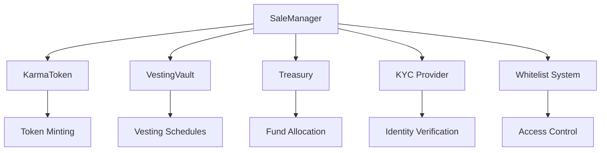

# Stage 3: Token Sales Engine

> **Multi-phase token sale system with sophisticated revenue management**

Stage 3 of the Karma Labs smart contract ecosystem implements a comprehensive token sales engine supporting multiple fundraising phases with advanced features including whitelist management, KYC integration, MEV protection, and automated revenue allocation.

## 🎯 Overview

The Token Sales Engine is designed to facilitate secure, efficient, and compliant token sales across three distinct phases:

- **Private Sale**: $0.02/token, 100M KARMA, $2M target (Accredited investors)
- **Pre-Sale**: $0.04/token, 100M KARMA, $4M target (Community members)  
- **Public Sale**: $0.05/token, 150M KARMA, $7.5M target (General public)

## 📋 Table of Contents

- [Features](#-features)
- [Architecture](#-architecture)
- [Installation](#-installation)
- [Quick Start](#-quick-start)
- [Configuration](#-configuration)
- [Deployment](#-deployment)
- [Testing](#-testing)
- [Integration](#-integration)
- [Security](#-security)
- [API Reference](#-api-reference)
- [Contributing](#-contributing)

## ✨ Features

### Core Functionality
- **Multi-Phase Sales**: Support for private, pre-sale, and public sale phases
- **Dynamic Pricing**: Phase-specific token pricing with automatic calculations
- **Allocation Management**: Per-phase allocation tracking and enforcement
- **Whitelist System**: Merkle tree-based whitelist verification
- **KYC Integration**: Built-in KYC and accreditation verification
- **Vesting Integration**: Automatic vesting schedule creation

### Advanced Features
- **MEV Protection**: Slippage protection and front-running prevention
- **Rate Limiting**: Anti-abuse mechanisms and purchase restrictions
- **Referral System**: Community-driven referral bonuses
- **Engagement Scoring**: Bonus allocation based on community engagement
- **Emergency Controls**: Pause functionality and emergency withdrawals
- **Treasury Integration**: Automatic fund forwarding and allocation

### Revenue Management
- **Automated Allocation**: 30% Marketing, 20% KOL, 30% Development, 20% Buyback
- **Transparent Reporting**: Real-time analytics and compliance reporting
- **Fund Security**: Multi-signature controls and emergency recovery
- **External Integrations**: Analytics platforms and compliance providers

## 🏗 Architecture

### Contract Structure

```
protocol/03-token-sales-engine/
├── contracts/
│   ├── SaleManager.sol              # Core sale management contract
│   ├── interfaces/
│   │   └── ISaleManager.sol         # Sale manager interface
│   ├── sales/                       # Sale phase implementations
│   │   ├── PrivateSale.sol         # Private sale logic (future)
│   │   ├── PreSale.sol             # Pre-sale logic (future)
│   │   └── PublicSale.sol          # Public sale logic (future)
│   └── utils/
│       └── MerkleWhitelist.sol     # Whitelist verification (future)
├── test/
│   ├── SaleManager.test.js         # Core SaleManager tests
│   ├── Stage3.1.test.js           # Core architecture tests
│   ├── Stage3.2.test.js           # Phase implementation tests
│   └── Stage3.3.test.js           # Revenue management tests
├── scripts/
│   ├── deploy-stage3.1.js         # Core deployment script
│   ├── deploy-stage3.2.js         # Phase deployment script
│   ├── deploy-stage3.3.js         # Revenue deployment script
│   └── [setup/validation scripts]
├── config/
│   ├── stage3.1-config.json       # Core configuration
│   ├── stage3.2-config.json       # Phase configuration
│   └── stage3.3-config.json       # Revenue configuration
└── utils/
    ├── price-calculator.js        # Token pricing utilities
    └── merkle-helpers.js          # Whitelist management
```

### Integration Points



## 🚀 Installation

### Prerequisites

- Node.js >= 16.0.0
- npm >= 8.0.0
- Hardhat
- Git

### Clone and Install

```bash
# Clone the repository
git clone https://github.com/karma-labs/smart-contracts.git
cd smart-contracts/protocol/03-token-sales-engine

# Install dependencies
npm install

# Install peer dependencies
npm install merkletreejs keccak256
```

### Environment Setup

Create a `.env` file:

```bash
# Network Configuration
ARBITRUM_RPC_URL=https://arb1.arbitrum.io/rpc
ARBITRUM_GOERLI_RPC_URL=https://goerli-rollup.arbitrum.io/rpc

# Private Keys (use test keys for development)
PRIVATE_KEY=your_private_key_here

# API Keys
ARBISCAN_API_KEY=your_arbiscan_api_key
ETHERSCAN_API_KEY=your_etherscan_api_key
COINMARKETCAP_API_KEY=your_cmc_api_key

# External Integrations
KYC_API_KEY=your_kyc_api_key
DISCORD_WEBHOOK_URL=your_discord_webhook
```

## 🎯 Quick Start

### 1. Compile Contracts

```bash
npm run compile
```

### 2. Run Tests

```bash
# Run all tests
npm test

# Run specific stage tests
npm run test:stage3.1
npm run test:stage3.2
npm run test:stage3.3

# Run with coverage
npm run test:coverage
```

### 3. Deploy to Testnet

```bash
# Deploy Stage 3.1 (Core Architecture)
npm run deploy:stage3.1

# Deploy Stage 3.2 (Phase Implementations)
npm run deploy:stage3.2

# Deploy Stage 3.3 (Revenue Management)
npm run deploy:stage3.3
```

### 4. Setup and Validate

```bash
# Setup all components
npx hardhat setup-all --network arbitrumGoerli

# Validate deployments
npx hardhat validate-all --network arbitrumGoerli
```

## ⚙️ Configuration

### Sale Phase Configuration

Edit `config/stage3.2-config.json` to customize sale parameters:

```json
{
  "privateSaleConfig": {
    "pricing": {
      "tokenPrice": "0.02",
      "tokensPerEth": 50000
    },
    "limits": {
      "minimumPurchaseUsd": 25000,
      "maximumPurchaseUsd": 200000
    },
    "requirements": {
      "kycRequired": true,
      "accreditationRequired": true,
      "whitelistRequired": true
    }
  }
}
```

### Security Configuration

Configure security settings in `config/stage3.1-config.json`:

```json
{
  "validation": {
    "rateLimiting": {
      "enabled": true,
      "windowSize": 300,
      "maxPurchasesPerWindow": 1
    },
    "frontRunningProtection": {
      "enabled": true,
      "maxGasPrice": "100000000000"
    }
  }
}
```

## 🚀 Deployment

### Deployment Process

1. **Pre-deployment Checks**
   ```bash
   # Verify configuration
   npx hardhat validate-config
   
   # Check network connection
   npx hardhat verify-network --network arbitrum
   ```

2. **Stage 3.1: Core Architecture**
   ```bash
   npx hardhat run scripts/deploy-stage3.1.js --network arbitrum
   ```

3. **Stage 3.2: Phase Implementations**
   ```bash
   npx hardhat run scripts/deploy-stage3.2.js --network arbitrum
   ```

4. **Stage 3.3: Revenue Management**
   ```bash
   npx hardhat run scripts/deploy-stage3.3.js --network arbitrum
   ```

### Post-deployment Setup

```bash
# Configure whitelists
npx hardhat generate-whitelist --input data/whitelist.csv --output artifacts/

# Setup KYC integration
npx hardhat run scripts/setup-kyc-integration.js --network arbitrum

# Initialize sale phases
npx hardhat run scripts/initialize-sales.js --network arbitrum
```

## 🧪 Testing

### Test Structure

The testing suite covers:

- **Unit Tests**: Individual contract function testing
- **Integration Tests**: Cross-contract interaction testing
- **Scenario Tests**: End-to-end user journey testing
- **Security Tests**: Attack vector and edge case testing

### Running Tests

```bash
# All tests
npm test

# Specific test files
npx hardhat test test/Stage3.1.test.js
npx hardhat test test/SaleManager.test.js

# With gas reporting
REPORT_GAS=true npm test

# Coverage analysis
npm run test:coverage
```

### Test Categories

#### Stage 3.1: Core Architecture
- Phase management system
- Purchase processing engine
- Whitelist and access control
- Emergency controls
- Integration tests

#### Stage 3.2: Phase Implementations
- Private sale mechanics ($0.02, accredited investors)
- Pre-sale mechanics ($0.04, community bonus system)
- Public sale mechanics ($0.05, MEV protection)
- Cross-phase integration
- Economic security

#### Stage 3.3: Revenue Management
- Treasury integration
- Fund allocation and tracking
- Security and anti-abuse
- Reporting and analytics
- Emergency recovery

## 🔗 Integration

### With Other Stages

Stage 3 integrates with:

- **Stage 1**: KarmaToken for minting and burning
- **Stage 2**: VestingVault for automatic vesting schedules
- **Stage 4**: Treasury for fund management and allocation

### External Integrations

- **KYC Providers**: Jumio, Verity for identity verification
- **Analytics**: Dune Analytics, DefiLlama for reporting
- **Compliance**: Chainalysis, Elliptic for AML screening
- **Notifications**: Discord, Telegram for alerts

### API Integration

```javascript
// Example: Purchase tokens with referral
const saleManager = await ethers.getContractAt("SaleManager", address);

const proof = generateMerkleProof(merkleTree, buyerAddress);
const tx = await saleManager.purchaseTokensWithReferral(
  proof,
  referrerAddress,
  { value: ethers.parseEther("10") }
);
```

## 🔒 Security

### Security Features

- **Access Control**: Role-based permissions and multi-signature requirements
- **Rate Limiting**: Purchase frequency and amount limitations
- **MEV Protection**: Front-running and sandwich attack prevention
- **Emergency Controls**: Pause functionality and circuit breakers
- **Audit Ready**: Comprehensive testing and documentation

### Security Best Practices

1. **Multi-signature Setup**: Require multiple signatures for critical operations
2. **Regular Monitoring**: Implement continuous monitoring and alerting
3. **Gradual Rollout**: Deploy to testnet first, then mainnet with limited exposure
4. **Incident Response**: Maintain emergency response procedures

### Audit Checklist

- [ ] Access control implementation
- [ ] Reentrancy protection
- [ ] Integer overflow/underflow protection
- [ ] Front-running protection
- [ ] Emergency pause functionality
- [ ] Fund recovery mechanisms

## 📚 API Reference

### SaleManager Core Functions

#### Purchase Functions
```solidity
function purchaseTokens(bytes32[] proof) external payable
function purchaseTokensWithReferral(bytes32[] proof, address referrer) external payable
function purchaseTokensWithMEVProtection(bytes32[] proof, uint256 minTokens) external payable
```

#### Admin Functions
```solidity
function configurePrivateSale(uint256 startTime, bytes32 merkleRoot) external
function configurePreSale(uint256 startTime, bytes32 merkleRoot) external
function configurePublicSale(uint256 startTime, LiquidityConfig config) external
function startSalePhase(SalePhase phase, PhaseConfig config) external
function endCurrentPhase() external
```

#### View Functions
```solidity
function getCurrentPhase() external view returns (SalePhase)
function getPhaseConfig(SalePhase phase) external view returns (PhaseConfig)
function calculateTokenAmount(uint256 ethAmount) external view returns (uint256)
function getAllocationBalance(SalePhase phase) external view returns (uint256)
```

### Utility Functions

#### Price Calculator
```javascript
const { calculateTokenAmount, calculateBonusTokens } = require('./utils/price-calculator');

// Calculate tokens for ETH amount
const tokens = calculateTokenAmount(ethAmount, 'PRIVATE_SALE');

// Calculate engagement bonus
const bonus = calculateBonusTokens(baseTokens, engagementScore);
```

#### Whitelist Management
```javascript
const { generateMerkleTree, generateMerkleProof } = require('./utils/merkle-helpers');

// Generate whitelist tree
const tree = generateMerkleTree(addresses);

// Generate proof for address
const proof = generateMerkleProof(tree, userAddress);
```

## 🤝 Contributing

### Development Workflow

1. **Fork the repository**
2. **Create a feature branch**: `git checkout -b feature/your-feature`
3. **Write tests**: Ensure 100% test coverage for new functionality
4. **Run tests**: `npm test` and `npm run test:coverage`
5. **Submit a pull request**: Include detailed description and test results

### Code Standards

- **Solidity**: Follow OpenZeppelin patterns and best practices
- **JavaScript**: Use ESLint configuration provided
- **Testing**: Minimum 95% code coverage required
- **Documentation**: Update README and inline comments

### Testing Requirements

- All new functions must have corresponding tests
- Integration tests for cross-contract interactions
- Security tests for potential attack vectors
- Gas optimization verification

## 📄 License

This project is licensed under the MIT License - see the [LICENSE](../../LICENSE) file for details.

## 🔗 Links

- **Documentation**: [https://docs.karmalabs.com](https://docs.karmalabs.com)
- **Website**: [https://karmalabs.com](https://karmalabs.com)
- **Twitter**: [@KarmaLabsAI](https://twitter.com/KarmaLabsAI)
- **Discord**: [Karma Labs Community](https://discord.gg/karmalabs)

## 📞 Support

For technical support or questions:

- **GitHub Issues**: [Create an issue](https://github.com/karma-labs/smart-contracts/issues)
- **Discord**: Join our developer channel
- **Email**: dev@karmalabs.com

---

**⚠️ Disclaimer**: This is experimental software. Use at your own risk. Always conduct thorough testing before deploying to mainnet. 